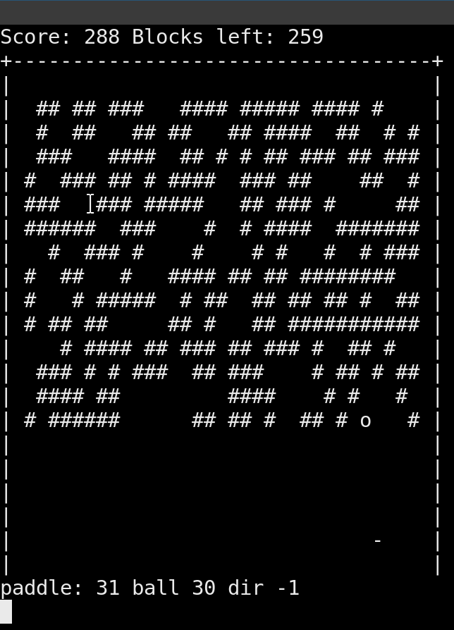

# What you can do with Joyride

(TL;DR: Almost anything you can do with an extension.)

* Workflows
* Add statusbar items
* Create Webviews
* Provide menus
* Open and control file editors
* Slide manager
* UI/Ux tweaks
* Retro games, anyone?
* Advent of Code 2022
* ...

🚗💨

[forum.v1engineering.com/t/advent-of-code/13416](https://forum.v1engineering.com/t/advent-of-code/13416)

